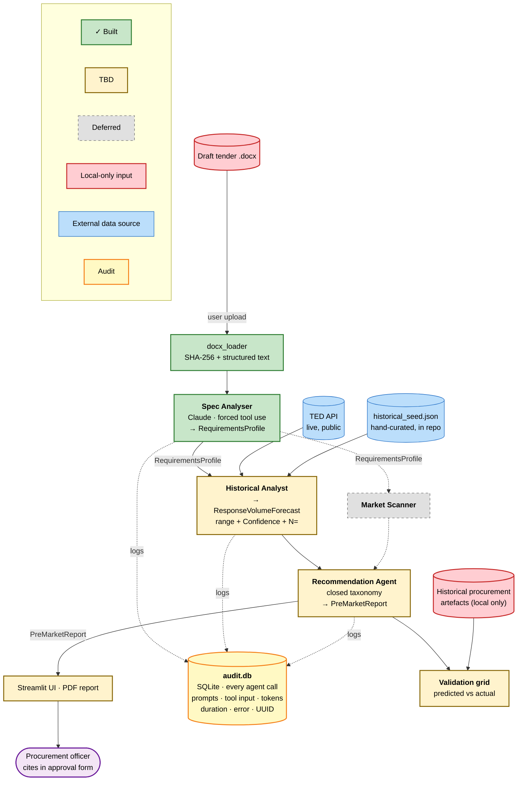

# Architecture

The Pre-Market Intelligence Agent reads a draft tender, runs four cooperating agents, and produces a Pre-Market Intelligence Report. Every agent call is audit-logged. The Recommendation Agent's output is constrained to a closed taxonomy so the system cannot invent free-form advice that reads as authoritative but isn't grounded.

## Agents

| Agent | Status | Job |
|---|---|---|
| **Spec Analyser** | Built | Parse draft tender → typed `RequirementsProfile` |
| **Historical Analyst** | In progress | TED + curated seed → `ResponseVolumeForecast` with range and confidence |
| **Market Scanner** | Deferred | Curated supplier index → `MarketDepth` |
| **Recommendation Agent** | In progress | Synthesise into `PreMarketReport`; choose from closed taxonomy of six kinds |

The orchestrator is deterministic — Spec Analyser, then a fan-out to Historical Analyst (and later Market Scanner), then Recommendation. The LLM does thinking inside each agent, never routing.

## Design choices

**Closed-taxonomy recommendations.** The Recommendation Agent selects from `SPLIT_TENDER`, `PIN_RFI_FIRST`, `TIGHTEN_QUALIFICATION`, `GEOGRAPHIC_FILTER`, `VALUE_BAND_REVIEW`, `KEY_PERSONNEL_FILTER`. No free-form recommendation strings. This is the main guard against hallucinated advice.

**Ranges with confidence bands, never point estimates.** `ResponseVolumeForecast` has lower/upper bounds and a `Confidence` (low/med/high). A single predicted-submissions number invites (correctly) immediate pushback.

**Forced tool use for structured extraction.** Each agent's Claude call passes the target Pydantic schema as the `input_schema` of a single tool and forces that tool, so the model must produce a typed object. Pydantic then validates downstream.

**Mandatory provenance.** `RequirementsProfile.provenance` is non-optional. Every claim derived from a tender carries the source file hash, extraction method, and timestamp — so a procurement officer can defend each citation in an approval form.

## Audit log

`audit.db` (SQLite) records one row per agent call: timestamp, agent name, model, full system + user prompts, structured output, response metadata (stop_reason, token usage), duration, and any error. This operationalises the audit-trail control discussed in the broader procurement-AI roadmap.

## Validation

For a closed tender with a known outcome, predictions in `PreMarketReport` are compared against the actual response count, evaluation duration, and award values. This is the credibility instrument — the agent's job is not just to produce a plausible-looking report but to make predictions that survive contact with reality.
